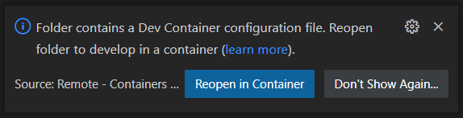

# Summary

This repository contains an example for scraping pricing data for a product from an online retailer that [displays their product prices within a Base64 encoded image](https://andshrew.github.io/PlayStation-Voucher-Prices/psn-50-voucher.html). It is written using Python 3.8 and performs OCR on the image to extract the price using the [Tesseract Open Source OCR Engine](https://github.com/tesseract-ocr/tesseract) (via the [pytesseract](https://pypi.org/project/pytesseract/) package). Additionally it can send standard Discord webhook messages when prices for products change, and a summary of which product represents the current best value.

This example is written in the context of tracking the price of PlayStation Network vouchers, where the retailer is selling these below RRP (Recommended Retail Price) and where the retailer offers a fixed rate discount for members of their customer loyalty scheme.

# Overview

The code for the main program ([app.py](app.py)) is commented such that it should be straight forward to understand what is being done and how this works. As a high level overview `check_psn_vouchers` does the following:
1. The program stores product data in a simple JSON formatted file [`data.json`](example/data.json)
2. Configuration for the Discord webhook URLs are stored in a JSON formatted file [`config.json`](example/config.json), or they can be passed as parameters to the `check_psn_vouchers` function. If neither exist Discord messaging will be disabled - but a correctly formatted [`config.json`](example/config.json) **must** still exist.
3. The program will itterate through each product in the [`data.json`](example/data.json) file
4. The [Beautiful Soup](https://www.crummy.com/software/BeautifulSoup/bs4/doc/) library is used to parse the response from the products URL
5. The Base64 encoded image (which displays the products price) is decoded and then processed using [OpenCV](https://pypi.org/project/opencv-python-headless/) to make it more suitable for OCR
6. The processed image is analysed using OCR with [pytesseract](https://pypi.org/project/pytesseract/) to extract the price from the image into a string.
7. The updated product data is saved back to the JSON formatted file [`data.json`](example/data.json)

Within [`data.json`](example/data.json):
 * If a products `price` is `-1` it will be considered a new product
 * If a products `error` is `-1` it will be considered disabled (set this to `0` to re-enable it)
 * If a products `error` reaches `12` it will be disabled the next time the program is run (set to `-1`)


# Running this example

## Visual Studio Code Remote - Containers

This repository contains [configuration](.devcontainer/devcontainer.json) for taking advantage of [Visual Studio Code's development container integration](https://code.visualstudio.com/docs/remote/containers), which tells it how to build a Python equiped Docker container suitable for using this example without having to install Python or it's dependencies on your host computer. This is built from a [Microsoft example](https://github.com/microsoft/vscode-remote-try-python).

**1. Follow [these steps to configure Visual Studio Code](https://code.visualstudio.com/docs/remote/containers#_getting-started)**

**2. Open this respository in Visual Studio Code**

You should be prompted that the folder contains a Dev Container configuration. Click **Reopen in Container**.


**3. Continue from [Step 8 of the Manual Configuration](#manual-execute-the-program)**

> ℹ️ **Info** <br>While running inside the Dev Container the prompt will not display `(.venv)` (as shown in the examples) as the virtual environment is not required when working inside the container.

## Manual Configuration - Ubuntu

These are instructions for running this example on Ubuntu ([Windows users should take advantage of WSL/WSL2](https://docs.microsoft.com/en-us/windows/wsl/install)).

**1. Install Python 3.8**
```
sudo apt install python3.8
```

**2. Install Python 3.8 virtual environment**
```
sudo apt install python3.8-venv
```
> ℹ️ **Info** <br>This enables the program to run (and install dependencies) within its own Python directory and not affect the system-wide Python installation

**3. Install Tesseract OCR**
```
sudo apt install tesseract-ocr
```

**4. Clone this repository and move into the root directory**
```
git clone https://github.com/andshrew/PlayStation-Voucher-Prices.git
cd PlayStation-Voucher-Prices
```

**5. Create and activate the virtual Python environment**
```
python3 -m venv .venv
source .venv/bin/activate
```
> ⚠️ **Warning** <br>The terminal prompt should now be prefixed with `(.venv)` to indicate the virtual Python environment is now loaded. If it does not display this then the following commands may install dependencies system-wide.

**6. Install the Python packages which the program depends on**
```
pip install -r requirements.txt
```

**7. Copy the example configuration files, make sure to add your own Discord webhook URLs in config.json**
```
cp example/data.json data.json
cp example/config.json config.json
nano config.json
```

**8. Execute the program**
<a id="manual-execute-the-program"></a>
```
python app.py check_psn_vouchers
```

The data included in `example\data.json` will demonstrate a new product, a product where the price has decreased, a product where the price has increased and a product which has reached the error limit set within the program. You should expect console output as follows:
```
(.venv) andshrew@UBUNTU:~/git/PlayStation-Voucher-Prices$ python app.py check_psn_vouchers
A new challenger! PlayStation Network £50.00 Voucher has been added at £44.85
Yaaay! PlayStation Network £40.00 Voucher was £40.00 now £35.85
Boooo! PlayStation Network £25.00 Voucher was £20.00 now £22.85
[check_psn_vouchers] error limit reached for product for id 3: it will remain disabled until the error count is manually reset
```

These Discord notifications will be be sent (if you have configured webhook URLs):


Subsequent executions would see the following console output, with no Discord notifications sent (as no changes have been found):
```
(.venv) andshrew@UBUNTU:~/git/PlayStation-Voucher-Prices$ python app.py check_psn_vouchers
PlayStation Network £50.00 Voucher price unchanged (£44.85 now £44.85)
PlayStation Network £40.00 Voucher price unchanged (£35.85 now £35.85)
PlayStation Network £25.00 Voucher price unchanged (£22.85 now £22.85)
```

# Running Automatically via Cron

As scraping product prices is something which would typically be done automatically and on a recurring basis the program can be executed on a schedule via Cron. The following example would run every 3 hours - it will set working directory to `/home/andshrew/git/PlayStation-Voucher-Prices`, activate the Python virtual environment and then execute the Python application.

```
0 */3 * * * echo 'cd /home/andshrew/git/PlayStation-Voucher-Prices; source .venv/bin/activate; python app.py check_psn_vouchers' | /bin/bash
```
